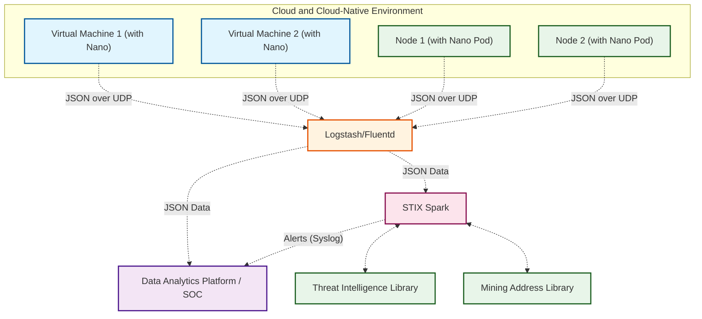

# STIX Spark

## 🎬Background

There are already several excellent projects for managing and matching various STIX libraries, but why are we still developing STIX Spark? The reason is actually very simple: they are all too complex. 

Our only requirement is to use a vast amount of logs as source data, efficiently match various STIX libraries in real time, and send the matching results back to SOC or other log analysis platforms. However, after researching several well-known STIX projects on Github, I felt that none of them quite met this goal. So, We decided to write a program in two or three days to achieve this goal myself.

## 🛠Introduction

STIX Spark is a program that utilizes any type of log as source data, offering a simple and efficient approach to matching against the STIX librarys and concurrently returning alerts.

Spark is typically deployed behind Logstash/Fluentd, ELF/Splunk/Graylog, or other SOC systems. 

Together with Modsecurity for Anylog (MSA), another project of Microflow.io, Spark analyzes high-quality traffic logs output by Nano to detect attack risks in cloud and cloud-native environments, monitor sensitive data behaviors, and perform threat intelligence STIX matching. 

If Nano is also integrated with mainstream log analysis platforms, it can also detect network-level attack risks and risks such as the use of weak passwords.

**Threat Intelligence Matching**

## 🤷‍♂️How to Use？

