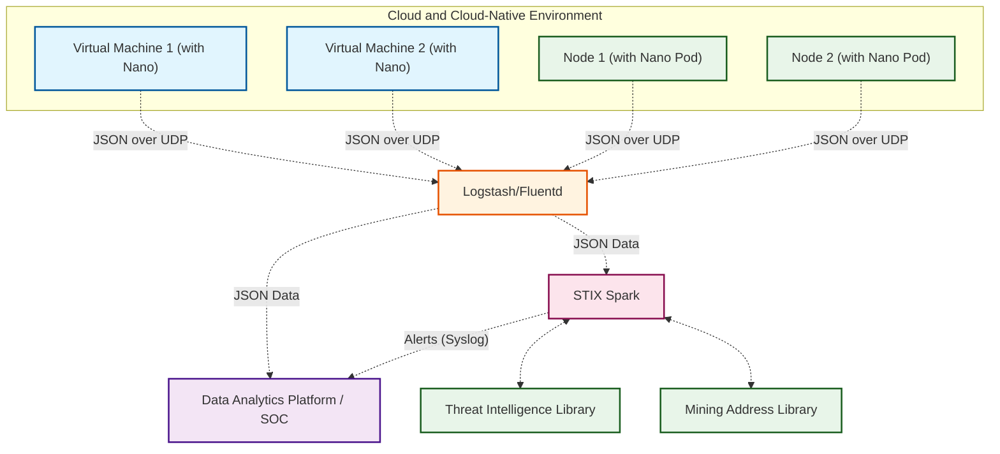

# STIX Spark


## 🎬Background

There are already several excellent projects for managing and matching various STIX libraries, but why are we still developing STIX Spark? The reason is actually very simple: they are all too complex. 

Our only requirement is to use a vast amount of logs as source data, efficiently match various STIX libraries in real time, and send the matching results back to SOC or other log analysis platforms. However, after researching several well-known STIX projects on Github, I felt that none of them quite met this goal. So, We decided to write a program in two or three days to achieve this goal myself.


## 🛠Introduction

STIX Spark is a program that utilizes any type of log as source data, offering a simple and efficient approach to matching against the STIX librarys and concurrently returning alerts.

Spark is typically deployed behind Logstash/Fluentd, ELF/Splunk/Graylog, or other SOC systems. 

Together with Modsecurity for Anylog (MSA), another project of Microflow.io, Spark analyzes high-quality traffic logs output by Nano to detect attack risks in cloud and cloud-native environments, monitor sensitive data behaviors, and perform threat intelligence STIX matching. 

If Nano is also integrated with mainstream log analysis platforms, it can also detect network-level attack risks and risks such as the use of weak passwords.


**Threat Intelligence Matching**




## 🤷‍♂️How to Use？

Clone the code

```bash
root@VM-8-2-ubuntu:/opt# git clone https://github.com/Microflow-IO/STIX-Spark.git
Cloning into 'STIX-Spark'...
```

Modify the LISTEN_PORT and OUTPUT environment variables according to your situation. Here, LISTEN_PORT is the JSON port for GELF format input, and OUTPUT is the JSON output port for alerts, both carried over UDP.

```bash
root@jxcloud-dev:/tmp# cd STIX-Spark/
root@jxcloud-dev:/tmp/STIX-Spark# cat docker-compose.yml | grep env -A 4
    environment:
      LISTEN_PORT: 15155
      OUTPUT: 127.0.0.1:12201
```

Use docker compose up -d to start the container

```bash
root@jxcloud-dev:/tmp/STIX-Spark# docker-compose up -d
[+] Running 1/1
 ✔ Container unistix  Started                                                         
root@jxcloud-dev:/tmp/STIX-Spark# docker ps -a | grep unistix
580f4589c2b1   registry.jxit.net.cn:5000/microflow/stix-spark:git-9   "sh -xc 'unistix -l …"   12 seconds ago   Up 11 seconds             unistix
```

Enter container check test data and script, sending test-unistix.json to port 15155 once per second

```bash
root@jxcloud-dev:/tmp/STIX-Spark# docker exec -it unistix sh
/unistix/stix-all # ps aux | grep unistix
7 root      0:00 unistix -l 15155 -m stix-file/result -s 127.0.0.1:12201 -p 127.0.0.1 -r
```
```bash
/unistix/stix-all # cd /usr/src/unistix/
/usr/src/unistix # cat test-stix.json 
{"BEGIN_TIME":"2024-06-12 15:00:00","SRC_IP":"192.168.1.12","DST_IP":"222.136.170.15","FORWARD":"32.23.65.32","RETCODE":"200","SRC_PORT":"20034","DST_PORT":"39361","REQ_HEADER":"/index.html","REQ_BODY":"aaaaaaaaaaa","RSP_HEADER":"HTTP 200 OK\r\n","RSP_BODY":"HTTP 200 OK\r\n","URL":"111/vadosaj.getenjoyment.net/92034677522.pdf","METHOD":"GET","L7_PROTOCOL":"http","message":"cccccccc","DOMAIN":"ipswich.able-plumbing.co.uk"}
/usr/src/unistix # cat test.sh 
#!/bin/bash

while true; do 
  timeout 1 nc -u 127.0.0.1 15155 < test-stix.json
  sleep 1
done
```

Start the script and use tcpdump to grab the 12201 alarm output port packet

```bash
/usr/src/unistix # nohup sh ./test.sh &
/usr/src/unistix # nohup: appending output to nohup.out
/usr/src/unistix # 
/usr/src/unistix # timeout 5 tcpdump -i lo port 12201 -w a.pcap
tcpdump: listening on lo, link-type EN10MB (Ethernet), snapshot length 262144 bytes
2 packets captured
6 packets received by filter
```

Open the packet file to verify the alarm generated by the attack

```bash
/usr/src/unistix # cat a.pcap 
{"rule_id":"16","alert_engine":"threat","time":"2024-06-12 15:00:00","message":"cccccccc","forward":"32.23.65.32","retcode":"200","s+ource":"","src_ip":"192.168.1.12","dst_ip":"222.136.170.15","geoip":"","src_port":"20034","dst_port":"39361","host":"","domain":"ipswich.able-plumbing.co.uk","url":"111/vadosaj.getenjoyment.net/92034677522.pdf","method":"GET","msg":"Mozi zombie network event","severity":"1"}
```
